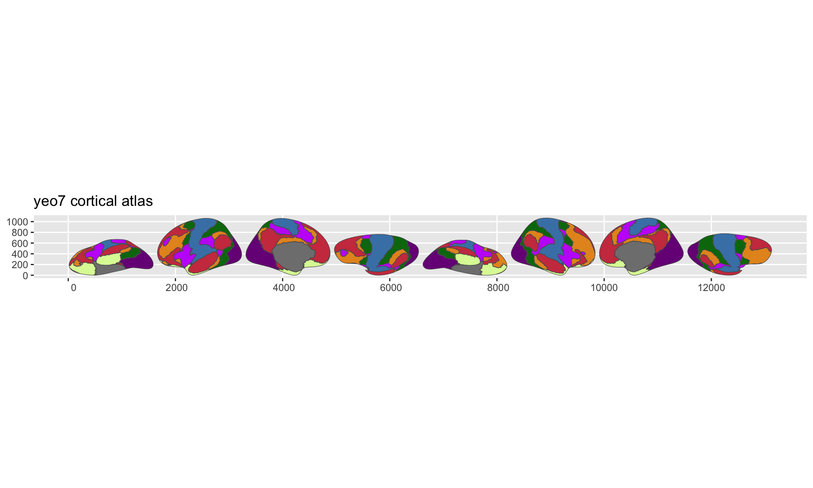

Cortical parcellations divide the brain surface into labelled regions.
They come from FreeSurfer annotation files, where each vertex on the cortical mesh is assigned to a region like "superior frontal gyrus" or "precuneus."

This tutorial walks through the full pipeline for turning an annotation into a `ggseg_atlas` you can plot with ggseg and ggseg3d.
We'll use the Yeo 7-network parcellation as a working example --- it has only 7 regions per hemisphere, so the pipeline runs quickly.

## What you need

- The `freesurferformats` R package (reads `.annot` files; no FreeSurfer
  installation required)
- The `fsaverage5` subject directory (ships with a FreeSurfer install, or
  can be downloaded separately)


``` r
library(ggseg.extra)
library(ggseg.formats)
library(dplyr)
```

## Locating annotation files

FreeSurfer stores annotation files alongside the subject's surface data.
You need the full paths to the `lh.` and `rh.` annotation files:


``` r
fs_dir <- freesurfer::fs_dir()
subjects_dir <- file.path(fs_dir, "subjects")

annot_files <- file.path(
  subjects_dir, "fsaverage5", "label",
  c("lh.Yeo2011_7Networks_N1000.annot",
    "rh.Yeo2011_7Networks_N1000.annot")
)

all(file.exists(annot_files))
#> [1] TRUE
```

## Creating the atlas

The pipeline reads the annotation, extracts vertex-to-region assignments, and
projects the inflated mesh triangles directly to 2D polygons via orthographic
projection. This is fast (seconds, not minutes) and requires no external
dependencies beyond FreeSurfer for reading the annotation:


``` r
output_dir <- file.path(tempdir(), "yeo7_tutorial")

yeo7_raw <- create_cortical_from_annotation(
  input_annot = annot_files,
  atlas_name = "yeo7",
  output_dir = output_dir,
  tolerance = 0.5,
  skip_existing = TRUE,
  cleanup = FALSE,
  verbose = TRUE
)
#>
#> ── Creating brain atlas "yeo7" ───────────
#> ℹ Input files: …
#> ℹ Setting output directory to …
#> ✔ 1/2 Loaded existing atlas data
#> ℹ 2/2 Projecting mesh to 2D polygons
#> ✔ 2/2 Projecting mesh to 2D polygons
#> ✔ Brain atlas created with 16 regions
#> ℹ Pipeline completed in 4.2 seconds

yeo7_raw
#>
#> ── yeo7 ggseg atlas ──────────────────────
#> Type: cortical
#> Regions: 8
#> Hemispheres: left, right
#> Views: inferior, lateral, medial,
#> superior
#> Palette: ✔
#> Rendering: ✔ ggseg
#> ✔ ggseg3d (vertices)
#> ──────────────────────────────────────────
#> # A tibble: 16 × 3
#>    hemi  region                      label
#>    <chr> <chr>                       <chr>
#>  1 left  FreeSurfer_Defined_Medial_… lh_F…
#>  2 left  7Networks_1                 lh_7…
#>  3 left  7Networks_2                 lh_7…
#>  4 left  7Networks_3                 lh_7…
#>  5 left  7Networks_4                 lh_7…
#>  6 left  7Networks_5                 lh_7…
#>  7 left  7Networks_6                 lh_7…
#>  8 left  7Networks_7                 lh_7…
#>  9 right FreeSurfer_Defined_Medial_… rh_F…
#> 10 right 7Networks_1                 rh_7…
#> 11 right 7Networks_2                 rh_7…
#> 12 right 7Networks_3                 rh_7…
#> 13 right 7Networks_4                 rh_7…
#> 14 right 7Networks_5                 rh_7…
#> 15 right 7Networks_6                 rh_7…
#> 16 right 7Networks_7                 rh_7…
```

A few things to note about the parameters:

- **`tolerance`** controls vertex simplification in the output polygons. Higher values mean simpler polygons with fewer vertices. Default is 0.5; use 0 for maximum fidelity.
- **`cleanup = FALSE`** keeps intermediate files (cached step 1 data) so you can re-run without re-reading annotations.
- **`skip_existing = TRUE`** reuses existing intermediate files when resuming an interrupted run.

## Step 3: Post-processing

The raw atlas contains every region from the annotation, including labels like "unknown" and "corpuscallosum" that you typically want as background outlines rather than filled regions.

`atlas_region_contextual()` keeps the geometry for spatial reference but removes the region from `$core`, so it renders as an outline:


``` r
yeo7_raw <- yeo7_raw |>
  atlas_region_contextual("cortex", match_on = "label") |>
  atlas_region_contextual("unknown", match_on = "label") |>
  atlas_region_contextual("corpuscallosum", match_on = "label") |>
  atlas_region_contextual("FreeSurfer_Defined_Medial_Wall", match_on = "label")
```

## Step 4: Adding metadata

The raw atlas has region names derived from the annotation file.
For the Yeo atlas, the annotation labels are numeric network IDs.
We can map them to descriptive network names:


``` r
yeo7_metadata <- data.frame(
  label = c(
    "7Networks_1", "7Networks_2", "7Networks_3", "7Networks_4",
    "7Networks_5", "7Networks_6", "7Networks_7"
  ),
  region_pretty = c(
    "visual", "somatomotor", "dorsal attention",
    "ventral attention", "limbic", "frontoparietal", "default"
  )
)

core_with_meta <- yeo7_raw$core |>
  left_join(yeo7_metadata, by = "label") |>
  mutate(region = coalesce(region_pretty, region)) |>
  select(hemi, region, label)
```

## Step 5: Rebuilding the atlas

Construct the final atlas from the modified core:


``` r
yeo7 <- ggseg_atlas(
  atlas = yeo7_raw$atlas,
  type = yeo7_raw$type,
  palette = yeo7_raw$palette,
  core = core_with_meta,
  data = yeo7_raw$data
)

yeo7
#>
#> ── yeo7 ggseg atlas ──────────────────────
#> Type: cortical
#> Regions: 7
#> Hemispheres: left, right
#> Views: inferior, lateral, medial,
#> superior
#> Palette: ✔
#> Rendering: ✔ ggseg
#> ✔ ggseg3d (vertices)
#> ──────────────────────────────────────────
#> # A tibble: 14 × 3
#>    hemi  region      label
#>    <chr> <chr>       <chr>
#>  1 left  7Networks_1 lh_7Networks_1
#>  2 left  7Networks_2 lh_7Networks_2
#>  3 left  7Networks_3 lh_7Networks_3
#>  4 left  7Networks_4 lh_7Networks_4
#>  5 left  7Networks_5 lh_7Networks_5
#>  6 left  7Networks_6 lh_7Networks_6
#>  7 left  7Networks_7 lh_7Networks_7
#>  8 right 7Networks_1 rh_7Networks_1
#>  9 right 7Networks_2 rh_7Networks_2
#> 10 right 7Networks_3 rh_7Networks_3
#> 11 right 7Networks_4 rh_7Networks_4
#> 12 right 7Networks_5 rh_7Networks_5
#> 13 right 7Networks_6 rh_7Networks_6
#> 14 right 7Networks_7 rh_7Networks_7
```


``` r
atlas_regions(yeo7) |> sort()
#> [1] "7Networks_1" "7Networks_2"
#> [3] "7Networks_3" "7Networks_4"
#> [5] "7Networks_5" "7Networks_6"
#> [7] "7Networks_7"
```


``` r
plot(yeo7)
```

<div class="figure">

<p class="caption">Yeo 7-network cortical parcellation plotted with ggseg.</p>
</div>

## Applying the same pattern to larger atlases

The Yeo 7-network atlas runs in seconds because it has few regions.
Larger atlases like aparc (34 regions/hemisphere) or Glasser (180 regions/hemisphere) take a bit longer but follow the same pattern and still complete in under a minute:


``` r
dk_annots <- file.path(
  subjects_dir, "fsaverage5", "label",
  c("lh.aparc.annot", "rh.aparc.annot")
)

dk <- create_cortical_from_annotation(
  input_annot = dk_annots,
  atlas_name = "dk",
  output_dir = "data-raw"
)
```

## Saving

Once you're satisfied with the atlas, save it as package data:


``` r
usethis::use_data(yeo7, overwrite = TRUE, compress = "xz")
```

The `compress = "xz"` flag gives the best compression for sf geometry data.
