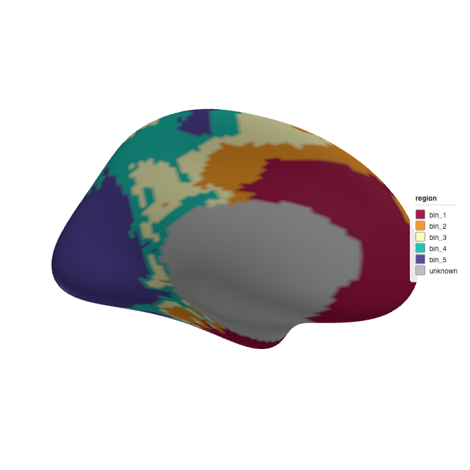
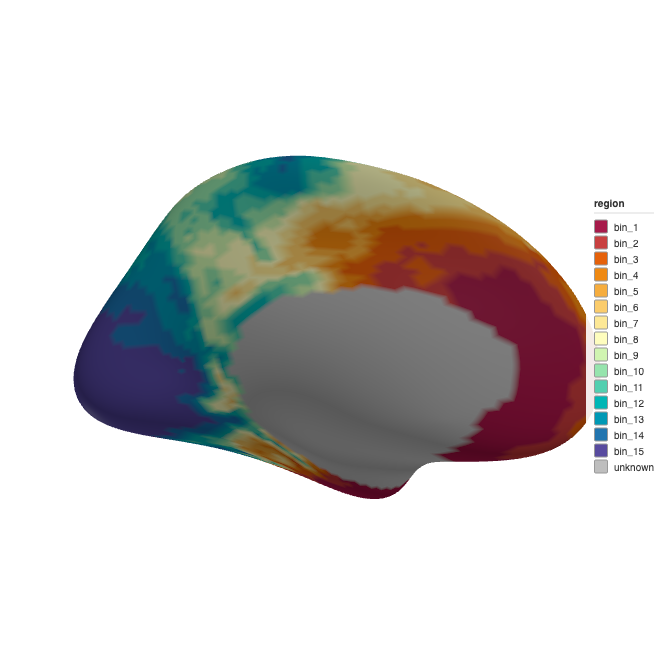
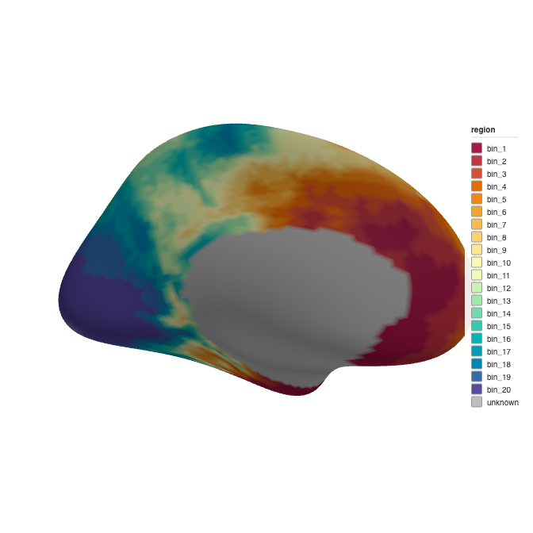
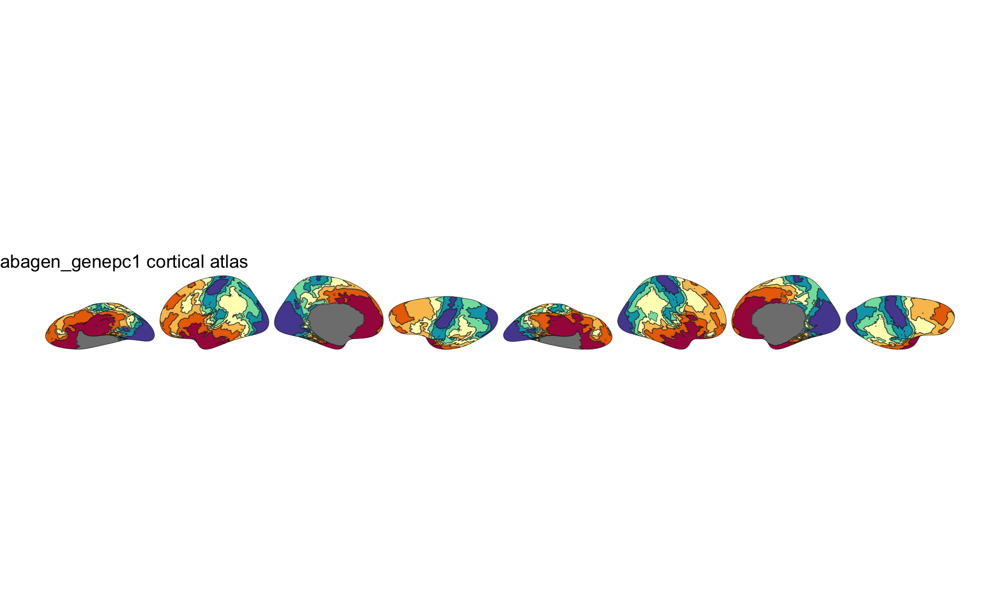
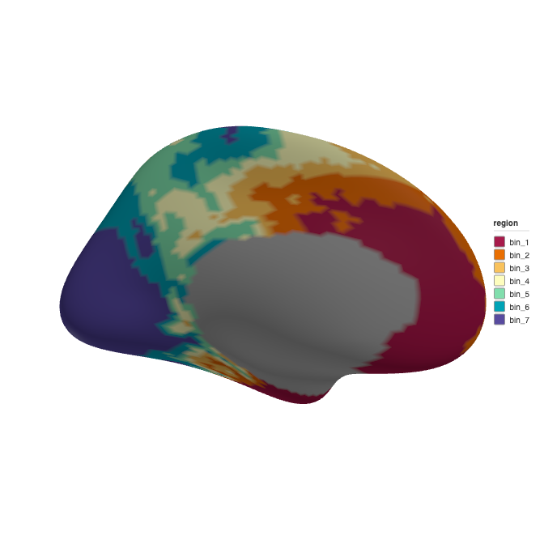

The [neuromaps](https://github.com/netneurolab/neuromaps) project provides standardized brain maps from published studies --- PET receptor densities, gene expression gradients, cortical thickness, and hundreds of other measures.
These brain maps are continuous: each vertex on the cortical surface has a floating-point value rather than a parcel label.

`create_cortical_from_neuromaps()` turns any neuromaps annotation into a ggseg atlas by discretizing the continuous values into quantile bins, each becoming a plottable region.
This tutorial walks through the full workflow, from fetching an annotation to fine-tuning the binning.

## What you need

- The [neuromapr](https://github.com/ggsegverse/neuromapr) R package (for
  fetching neuromaps annotations)
- For **surface** annotations (GIFTI): no system tools needed
- For **volume** annotations (NIfTI): FreeSurfer installed with `fsaverage5`
  (uses `mri_vol2surf` to project the volume onto the cortical surface)


``` r
library(ggseg.extra)
library(ggseg.formats)
library(dplyr)
library(ggplot2)
```

## Fetching a neuromaps annotation

The `source` and `desc` arguments identify the brain map in the neuromaps registry.
For this tutorial we use the first principal component of gene expression from the Allen Human Brain Atlas, provided by [abagen](https://abagen.readthedocs.io/).


``` r
atlas_auto <- create_cortical_from_neuromaps(
  source = "abagen",
  desc = "genepc1",
  atlas_name = "abagen_genepc1"
)

atlas_auto
#>
#> ── abagen_genepc1 ggseg atlas ────────────
#> Type: cortical
#> Regions: 16
#> Hemispheres: left, right
#> Views: inferior, lateral, medial, superior
#> Palette: ✔
#> Rendering: ✔ ggseg
#> ✔ ggseg3d (vertices)
#> ──────────────────────────────────────────
#> # A tibble: 32 × 3
#>    hemi  region  label     
#>    <chr> <chr>   <chr>     
#>  1 left  bin_1   lh_bin_1  
#>  2 left  bin_2   lh_bin_2  
#>  3 left  bin_3   lh_bin_3  
#>  4 left  bin_4   lh_bin_4  
#>  5 left  bin_5   lh_bin_5  
#>  6 left  bin_6   lh_bin_6  
#>  7 left  bin_7   lh_bin_7  
#>  8 left  bin_8   lh_bin_8  
#>  9 left  bin_9   lh_bin_9  
#> 10 left  bin_10  lh_bin_10 
#> 11 left  bin_11  lh_bin_11 
#> 12 left  bin_12  lh_bin_12 
#> 13 left  bin_13  lh_bin_13 
#> 14 left  bin_14  lh_bin_14 
#> 15 left  bin_15  lh_bin_15 
#> 16 left  unknown lh_unknown
#> 17 right bin_1   rh_bin_1  
#> 18 right bin_2   rh_bin_2  
#> 19 right bin_3   rh_bin_3  
#> 20 right bin_4   rh_bin_4  
#> 21 right bin_5   rh_bin_5  
#> 22 right bin_6   rh_bin_6  
#> 23 right bin_7   rh_bin_7  
#> 24 right bin_8   rh_bin_8  
#> 25 right bin_9   rh_bin_9  
#> 26 right bin_10  rh_bin_10 
#> 27 right bin_11  rh_bin_11 
#> 28 right bin_12  rh_bin_12 
#> 29 right bin_13  rh_bin_13 
#> 30 right bin_14  rh_bin_14 
#> 31 right bin_15  rh_bin_15 
#> 32 right unknown rh_unknown
```

The pipeline reads the annotation, bins the values, and projects the mesh to 2D polygons --- all in seconds.

The regions listed are the quantile bins the pipeline created automatically.
Each bin corresponds to a range of gene expression values and covers roughly the same number of vertices.

## How binning works

Neuromaps annotations are continuous --- every vertex has a value like 0.42 or −1.73 rather than a label like "precuneus."
To turn these into plottable atlas regions, the pipeline discretizes the values into bins.
Each bin becomes a region colored along a spectral gradient from low to high values.

### Auto-detection: parcellation vs. continuous

When the pipeline reads the annotation data, it first checks whether the vertex values are integers or floating-point:

- **Integer values** → treated as a parcellation. Each unique ID becomes a region. Value 0 is the medial wall. No binning.
- **Floating-point values** → treated as a continuous brain map. NaN vertices are the medial wall. Remaining values are binned.

This detection is automatic.
If you have a parcellation map from neuromaps (like Schaefer parcels), the pipeline will handle it as discrete regions without binning.

### The `n_bins` parameter

`n_bins` controls how many quantile bins continuous data is split into.

**NULL (the default)** uses Sturges' rule to auto-detect the bin count.
The formula is `1 + log2(n)` where *n* is the number of valid (non-NaN) vertices, clamped to the range 5--20.
For fsaverage5 with 10,242 vertices per hemisphere, this gives `1 + log2(10242) ≈ 14` bins.


``` r
nrow(atlas_auto$core)
#> [1] 32
atlas_auto$core |> filter(region != "unknown") |> distinct(region)
#> # A tibble: 15 × 1
#>    region
#>    <chr> 
#>  1 bin_1 
#>  2 bin_2 
#>  3 bin_3 
#>  4 bin_4 
#>  5 bin_5 
#>  6 bin_6 
#>  7 bin_7 
#>  8 bin_8 
#>  9 bin_9 
#> 10 bin_10
#> 11 bin_11
#> 12 bin_12
#> 13 bin_13
#> 14 bin_14
#> 15 bin_15
```

**An explicit integer** overrides auto-detection.
Use fewer bins for a cleaner, more schematic look; more bins for finer spatial resolution.


``` r
atlas_5 <- create_cortical_from_neuromaps(
  source = "abagen",
  desc = "genepc1",
  n_bins = 5,
  atlas_name = "abagen_5bin"
)

atlas_5$core |> filter(region != "unknown") |> distinct(region)
#> # A tibble: 5 × 1
#>   region
#>   <chr> 
#> 1 bin_1 
#> 2 bin_2 
#> 3 bin_3 
#> 4 bin_4 
#> 5 bin_5
```


``` r
atlas_20 <- create_cortical_from_neuromaps(
  source = "abagen",
  desc = "genepc1",
  n_bins = 20,
  atlas_name = "abagen_20bin"
)

atlas_20$core |> filter(region != "unknown") |> distinct(region)
#> # A tibble: 20 × 1
#>    region
#>    <chr> 
#>  1 bin_1 
#>  2 bin_2 
#>  3 bin_3 
#>  4 bin_4 
#>  5 bin_5 
#>  6 bin_6 
#>  7 bin_7 
#>  8 bin_8 
#>  9 bin_9 
#> 10 bin_10
#> 11 bin_11
#> 12 bin_12
#> 13 bin_13
#> 14 bin_14
#> 15 bin_15
#> 16 bin_16
#> 17 bin_17
#> 18 bin_18
#> 19 bin_19
#> 20 bin_20
```

### Quantile-based breaks

Bins are created using quantile breaks, not equal-width intervals.
This means each bin contains approximately the same number of vertices.

Equal-width bins would leave most vertices in a few central bins when the distribution is skewed, which is common for brain maps.
Quantile binning ensures every bin contributes visible surface area to the atlas, making the resulting plot informative regardless of the data distribution.

### Color palette

Bins are colored using the HCL Spectral palette.
Bin 1 (lowest values) gets the cool end of the spectrum, and the last bin (highest values) gets the warm end.
The medial wall is always grey (`#BEBEBE`) and labeled "unknown."


``` r
atlas_auto$palette
#>   lh_bin_1   lh_bin_2   lh_bin_3 
#>  "#A71B4B"  "#C84040"  "#E5610A" 
#>   lh_bin_4   lh_bin_5   lh_bin_6 
#>  "#EF8913"  "#F6AD3E"  "#FBCC6B" 
#>   lh_bin_7   lh_bin_8   lh_bin_9 
#>  "#FDE896"  "#FEFDBE"  "#D0F4B1" 
#>  lh_bin_10  lh_bin_11  lh_bin_12 
#>  "#96E4AD"  "#52CFB0"  "#00B6B5" 
#>  lh_bin_13  lh_bin_14  lh_bin_15 
#>  "#0099B5"  "#2275AF"  "#584B9F" 
#> lh_unknown   rh_bin_1   rh_bin_2 
#>  "#BEBEBE"  "#A71B4B"  "#C84040" 
#>   rh_bin_3   rh_bin_4   rh_bin_5 
#>  "#E5610A"  "#EF8913"  "#F6AD3E" 
#>   rh_bin_6   rh_bin_7   rh_bin_8 
#>  "#FBCC6B"  "#FDE896"  "#FEFDBE" 
#>   rh_bin_9  rh_bin_10  rh_bin_11 
#>  "#D0F4B1"  "#96E4AD"  "#52CFB0" 
#>  rh_bin_12  rh_bin_13  rh_bin_14 
#>  "#00B6B5"  "#0099B5"  "#2275AF" 
#>  rh_bin_15 rh_unknown 
#>  "#584B9F"  "#BEBEBE"
```

## Visualizing the effect of bin count

Comparing the 3D rendering across different bin counts makes it easy to choose the right level of detail:


``` r
ggseg3d::ggseg3d(atlas = atlas_5, hemisphere = "left")
```

<div class="figure">

<p class="caption">3D brain rendering with 5 quantile bins.</p>
</div>


``` r
ggseg3d::ggseg3d(atlas = atlas_auto, hemisphere = "left")
```

<div class="figure">

<p class="caption">3D brain rendering with auto-detected bins (Sturges' rule).</p>
</div>


``` r
ggseg3d::ggseg3d(atlas = atlas_20, hemisphere = "left")
```

<div class="figure">

<p class="caption">3D brain rendering with 20 quantile bins.</p>
</div>

## Tuning tolerance

The `tolerance` parameter controls polygon simplification.
We use 7 bins here with a tolerance of 0.5 for a balance between clarity and file size:


``` r
atlas_full <- create_cortical_from_neuromaps(
  source = "abagen",
  desc = "genepc1",
  n_bins = 7,
  atlas_name = "abagen_genepc1",
  tolerance = 0.5,
  verbose = TRUE
)
#>
#> ── Creating brain atlas "abagen_genepc1" ──
#> ℹ Reading neuromaps annotation
#> ✔ Reading neuromaps annotation
#> ℹ Projecting mesh to 2D polygons
#> ✔ Projecting mesh to 2D polygons
#> ✔ Brain atlas created with 16 regions

## Post-processing

The "unknown" region (medial wall) renders as a filled region by default.
Convert it to a background outline with `atlas_region_contextual()`:


``` r
atlas_clean <- atlas_full |>
  atlas_region_contextual("unknown", match_on = "label")
```

## Rendering the final atlas


``` r
plot(atlas_clean, show.legend = FALSE) +
  theme_void()
```

<div class="figure">

<p class="caption">2D gene expression atlas plotted with ggseg.</p>
</div>


``` r
ggseg3d::ggseg3d(atlas = atlas_clean, hemisphere = "left")
```

<div class="figure">

<p class="caption">3D rendering of the final gene expression atlas.</p>
</div>

## Working with parcellation maps

Not all neuromaps annotations are continuous.
Some contain integer vertex labels where each value maps to a brain region.
The pipeline detects this automatically and skips binning entirely.

For parcellations, you can provide a `label_table` to map the numeric IDs to human-readable region names and custom colors:


``` r
labels <- data.frame(
  id = c(1, 2, 3),
  region = c("visual", "somatomotor", "dorsal_attention"),
  colour = c("#781286", "#4682B4", "#00760E")
)

atlas <- create_cortical_from_neuromaps(
  source = "schaefer",
  desc = "400Parcels7Networks",
  label_table = labels
)
```

Parcels not listed in `label_table` are auto-named as `parcel_1`, `parcel_2`, etc. and assigned colors from the Set2 palette.

## Volume annotations

Some neuromaps annotations are volumetric NIfTI files in MNI152 space rather than surface GIFTI files.
The pipeline detects this from the file extension (`.nii` or `.nii.gz`) and projects the volume onto the fsaverage5 surface using FreeSurfer's `mri_vol2surf`.


``` r
atlas_vol <- create_cortical_from_neuromaps(
  source = "pet",
  desc = "5HT1a",
  atlas_name = "serotonin_5ht1a",
  n_bins = 10
)
```

The volume-to-surface projection samples across cortical depth (0% to 100% in 10% steps) and takes the maximum value at each vertex, giving robust coverage even for thin cortical signals.
FreeSurfer is always required for volume annotations.

## Reading annotation files directly

If you already have GIFTI files on disk --- from neuromaps, Connectome Workbench, or another source --- you can bypass the fetching step and read them directly with `read_neuromaps_annotation()`:


``` r
files <- neuromapr::fetch_neuromaps_annotation(
  source = "abagen",
  desc = "genepc1",
  space = "fsaverage",
  density = "10k",
  verbose = FALSE
)

annot_data <- read_neuromaps_annotation(files, n_bins = 7)
annot_data
#> # A tibble: 16 × 5
#>    hemi  region  label     colour vertices
#>    <chr> <chr>   <chr>     <chr>  <list>  
#>  1 left  bin_1   lh_bin_1  #A71B… <int>   
#>  2 left  bin_2   lh_bin_2  #E96F… <int>   
#>  3 left  bin_3   lh_bin_3  #F9C2… <int>   
#>  4 left  bin_4   lh_bin_4  #FEFD… <int>   
#>  5 left  bin_5   lh_bin_5  #81DE… <int>   
#>  6 left  bin_6   lh_bin_6  #00A3… <int>   
#>  7 left  bin_7   lh_bin_7  #584B… <int>   
#>  8 left  unknown lh_unkno… #BEBE… <int>   
#>  9 right bin_1   rh_bin_1  #A71B… <int>   
#> 10 right bin_2   rh_bin_2  #E96F… <int>   
#> 11 right bin_3   rh_bin_3  #F9C2… <int>   
#> 12 right bin_4   rh_bin_4  #FEFD… <int>   
#> 13 right bin_5   rh_bin_5  #81DE… <int>   
#> 14 right bin_6   rh_bin_6  #00A3… <int>   
#> 15 right bin_7   rh_bin_7  #584B… <int>   
#> 16 right unknown rh_unkno… #BEBE… <int>
```

For volume files in MNI152 space, use `read_neuromaps_volume()` instead.

## Choosing the right number of bins

| n_bins | Use case |
|--------|----------|
| 3--5 | High-level overview, schematic figures, publication thumbnails |
| 7--10 | Balanced detail, good for most visualizations |
| ~14 (auto) | Default; maximum spatial detail from Sturges' rule |
| 15--20 | Dense gradients where fine differences matter |

More bins means more regions and larger atlas objects.
The pipeline is fast regardless of bin count, so experiment freely.

## Saving

Once you're happy with the atlas, save it as package data:


``` r
usethis::use_data(abagen_genepc1, overwrite = TRUE, compress = "xz")
```

The `compress = "xz"` flag gives the best compression for sf geometry data.
