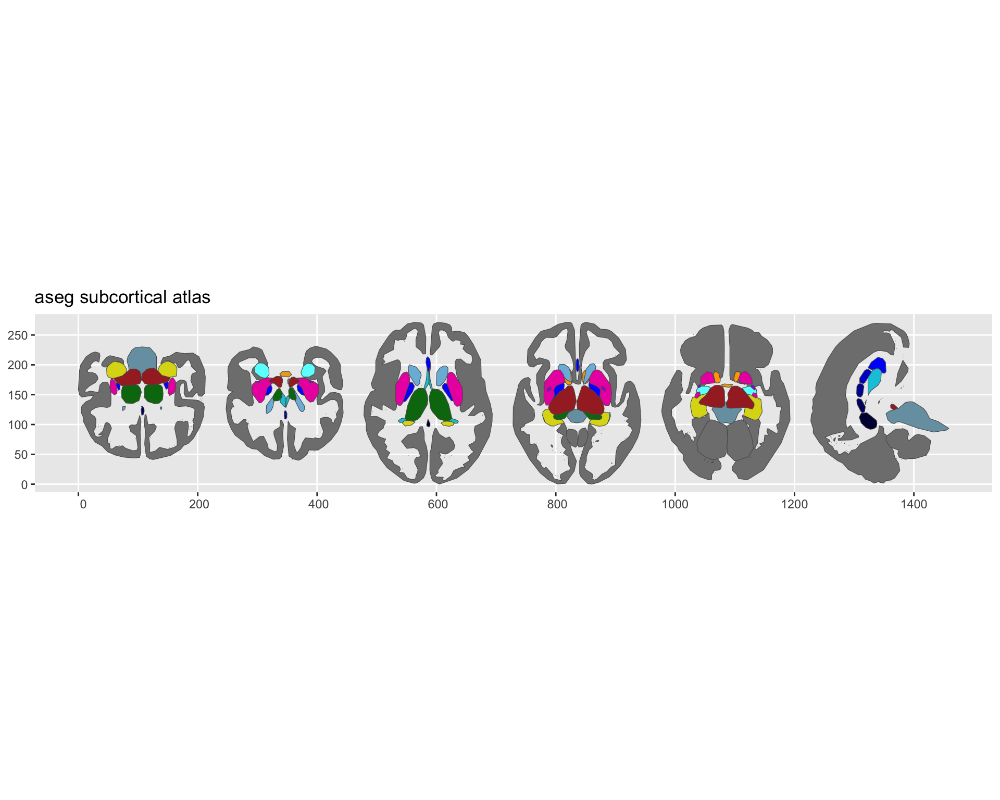

Subcortical atlases represent the structures beneath the cortical surface: thalamus, hippocampus, amygdala, caudate, putamen, and others.
They come from volumetric segmentations like FreeSurfer's `aseg.mgz`, where each voxel is assigned a label.

The pipeline tessellates labelled voxel regions into 3D meshes and (optionally) creates 2D projection views that collapse a slab of the volume onto a single plane.

This tutorial recreates the aseg atlas --- the same pipeline behind `data-raw/make_aseg_atlas.R` in ggseg.formats.

## What you need

- FreeSurfer installed with the `fsaverage5` subject
- ImageMagick for 2D geometry extraction
- Chrome/Chromium for 3D screenshots


``` r
library(ggseg.extra)
library(ggseg.formats)
library(dplyr)
```


``` r
fs_dir <- freesurfer::fs_dir()
subjects_dir <- file.path(fs_dir, "subjects")

aseg_volume <- file.path(subjects_dir, "fsaverage5", "mri", "aseg.mgz")
color_lut <- file.path(fs_dir, "ASegStatsLUT.txt")

if (!file.exists(color_lut)) {
  color_lut <- file.path(fs_dir, "FreeSurferColorLUT.txt")
}
```

## Creating the atlas

`create_subcortical_from_volume()` takes a segmentation volume and a colour lookup table.
The pipeline tessellates each labelled region into a 3D mesh, then creates 2D projection views:


``` r
aseg_raw <- create_subcortical_from_volume(
  input_volume = aseg_volume,
  input_lut = color_lut,
  atlas_name = "aseg"
)
#> Warning: Atlas has 11943 vertices (threshold:
#> 10000)
#> ℹ Large atlases may be slow to plot and
#>   increase package size
#> ℹ Re-run with higher `tolerance` to
#>   reduce vertices

aseg_raw
#> 
#> ── aseg ggseg atlas ──────────────────────
#> Type: subcortical
#> Regions: 27
#> Hemispheres: left, NA, right
#> Views: axial_1, axial_2, axial_3,
#> axial_4, axial_5, axial_6, axial_7,
#> coronal_1, coronal_2, coronal_3,
#> coronal_4, coronal_5, sagittal
#> Palette: ✔
#> Rendering: ✔ ggseg
#> ✔ ggseg3d (meshes)
#> ──────────────────────────────────────────
#> # A tibble: 43 × 3
#>    hemi  region                  label    
#>    <chr> <chr>                   <chr>    
#>  1 left  cerebral white matter   Left-Cer…
#>  2 left  cerebral cortex         Left-Cer…
#>  3 left  lateral ventricle       Left-Lat…
#>  4 left  inf lat vent            Left-Inf…
#>  5 left  cerebellum white matter Left-Cer…
#>  6 left  cerebellum cortex       Left-Cer…
#>  7 left  thalamus                Left-Tha…
#>  8 left  caudate                 Left-Cau…
#>  9 left  putamen                 Left-Put…
#> 10 left  pallidum                Left-Pal…
#> 11 <NA>  3rd ventricle           3rd-Vent…
#> 12 <NA>  4th ventricle           4th-Vent…
#> 13 <NA>  brain stem              Brain-St…
#> 14 left  hippocampus             Left-Hip…
#> 15 left  amygdala                Left-Amy…
#> 16 <NA>  csf                     CSF      
#> 17 left  accumbens area          Left-Acc…
#> 18 left  ventraldc               Left-Ven…
#> 19 left  vessel                  Left-ves…
#> 20 left  choroid plexus          Left-cho…
#> 21 right cerebral white matter   Right-Ce…
#> 22 right cerebral cortex         Right-Ce…
#> 23 right lateral ventricle       Right-La…
#> 24 right inf lat vent            Right-In…
#> 25 right cerebellum white matter Right-Ce…
#> 26 right cerebellum cortex       Right-Ce…
#> 27 right thalamus                Right-Th…
#> 28 right caudate                 Right-Ca…
#> 29 right putamen                 Right-Pu…
#> 30 right pallidum                Right-Pa…
#> 31 right hippocampus             Right-Hi…
#> 32 right amygdala                Right-Am…
#> 33 right accumbens area          Right-Ac…
#> 34 right ventraldc               Right-Ve…
#> 35 right vessel                  Right-ve…
#> 36 right choroid plexus          Right-ch…
#> 37 <NA>  wm hypointensities      WM-hypoi…
#> 38 <NA>  optic chiasm            Optic-Ch…
#> 39 <NA>  cc posterior            CC_Poste…
#> 40 <NA>  cc mid posterior        CC_Mid_P…
#> 41 <NA>  cc central              CC_Centr…
#> 42 <NA>  cc mid anterior         CC_Mid_A…
#> 43 <NA>  cc anterior             CC_Anter…
```

The default pipeline creates six projection views focused on the subcortical range:
axial inferior, axial superior, coronal posterior, coronal anterior, sagittal left, and sagittal right.
Each view collapses a slab of the volume onto a single plane, giving you spatial context without the complexity of individual slices.

## Removing unwanted regions

The aseg segmentation contains everything --- cortex, white matter, ventricles, CSF.
For a subcortical atlas, most of these are noise.
Remove them:


``` r
aseg_raw <- aseg_raw |>
  atlas_region_remove("White-Matter", match_on = "label") |>
  atlas_region_remove("WM-hypointensities", match_on = "label") |>
  atlas_region_remove("-Ventricle", match_on = "label") |>
  atlas_region_remove("-Vent$", match_on = "label") |>
  atlas_region_remove("CSF", match_on = "label") |>
  atlas_region_remove("Cerebral-Cortex", match_on = "label")
```

Patterns are regular expressions, so `-Vent$` matches "3rd-Vent" and "4th-Vent" without catching "Ventral-DC."

## Setting context regions

The cortex works well as a background outline --- it shows where subcortical structures sit relative to the brain surface without competing for colour:


``` r
aseg_raw <- aseg_raw |>
  atlas_region_contextual("Cortex", match_on = "label")
```

## Selecting views

Not all projection views are equally useful.
Keep the ones that show your structures best:


``` r
aseg_raw <- aseg_raw |>
  atlas_view_keep("axial_3|axial_5|coronal_2|coronal_3|coronal_4|sagittal")
```

## Cleaning up the layout

Gather views into a compact arrangement:


``` r
aseg_raw <- aseg_raw |>
  atlas_view_gather()
```

## Adding metadata

The raw labels are technical identifiers like "Left-Thalamus-Proper."
Join human-readable names and structural groupings:


``` r
normalize_region <- function(x) {
  ifelse(
    is.na(x),
    NA_character_,
    x |>
      tolower() |>
      gsub("-", " ", x = _) |>
      gsub("_", " ", x = _) |>
      gsub("left |right ", "", x = _) |>
      trimws()
  )
}

aseg_metadata <- data.frame(
  region = c(
    "Thalamus-Proper", "Caudate", "Putamen", "Pallidum",
    "Hippocampus", "Amygdala", "Accumbens-area", "VentralDC",
    "Brain-Stem"
  ),
  label_pretty = c(
    "thalamus", "caudate", "putamen", "pallidum",
    "hippocampus", "amygdala", "nucleus accumbens", "ventral DC",
    "brain stem"
  ),
  structure = c(
    "diencephalon", "basal ganglia", "basal ganglia", "basal ganglia",
    "limbic", "limbic", "basal ganglia", "diencephalon",
    "brainstem"
  )
)

core_with_meta <- aseg_raw$core |>
  mutate(region_key = normalize_region(region)) |>
  left_join(
    aseg_metadata |>
      mutate(region_key = normalize_region(region)) |>
      select(region_key, label_pretty, structure),
    by = "region_key"
  ) |>
  mutate(region = coalesce(label_pretty, region)) |>
  select(hemi, region, label, structure)
```

## Rebuilding and saving

Construct the final atlas from modified components:


``` r
aseg <- ggseg_atlas(
  atlas = aseg_raw$atlas,
  type = aseg_raw$type,
  palette = aseg_raw$palette,
  core = core_with_meta,
  data = aseg_raw$data
)

aseg
#> 
#> ── aseg ggseg atlas ──────────────────────
#> Type: subcortical
#> Regions: 17
#> Hemispheres: left, NA, right
#> Views: axial_3, axial_5, coronal_2,
#> coronal_3, coronal_4, sagittal
#> Palette: ✔
#> Rendering: ✔ ggseg
#> ✔ ggseg3d (meshes)
#> ──────────────────────────────────────────
#> # A tibble: 27 × 4
#>    hemi  region            label structure
#>    <chr> <chr>             <chr> <chr>    
#>  1 left  thalamus          Left… <NA>     
#>  2 left  caudate           Left… basal ga…
#>  3 left  putamen           Left… basal ga…
#>  4 left  pallidum          Left… basal ga…
#>  5 <NA>  brain stem        Brai… brainstem
#>  6 left  hippocampus       Left… limbic   
#>  7 left  amygdala          Left… limbic   
#>  8 left  nucleus accumbens Left… basal ga…
#>  9 left  ventral DC        Left… dienceph…
#> 10 left  vessel            Left… <NA>     
#> 11 left  choroid plexus    Left… <NA>     
#> 12 right thalamus          Righ… <NA>     
#> 13 right caudate           Righ… basal ga…
#> 14 right putamen           Righ… basal ga…
#> 15 right pallidum          Righ… basal ga…
#> 16 right hippocampus       Righ… limbic   
#> 17 right amygdala          Righ… limbic   
#> 18 right nucleus accumbens Righ… basal ga…
#> 19 right ventral DC        Righ… dienceph…
#> 20 right vessel            Righ… <NA>     
#> 21 right choroid plexus    Righ… <NA>     
#> 22 <NA>  optic chiasm      Opti… <NA>     
#> 23 <NA>  cc posterior      CC_P… <NA>     
#> 24 <NA>  cc mid posterior  CC_M… <NA>     
#> 25 <NA>  cc central        CC_C… <NA>     
#> 26 <NA>  cc mid anterior   CC_M… <NA>     
#> 27 <NA>  cc anterior       CC_A… <NA>
```


``` r
atlas_labels(aseg)
#>  [1] "Brain-Stem"          
#>  [2] "CC_Anterior"         
#>  [3] "CC_Central"          
#>  [4] "CC_Mid_Anterior"     
#>  [5] "CC_Mid_Posterior"    
#>  [6] "CC_Posterior"        
#>  [7] "Left-Accumbens-area" 
#>  [8] "Left-Amygdala"       
#>  [9] "Left-Caudate"        
#> [10] "Left-choroid-plexus" 
#> [11] "Left-Hippocampus"    
#> [12] "Left-Pallidum"       
#> [13] "Left-Putamen"        
#> [14] "Left-Thalamus"       
#> [15] "Left-VentralDC"      
#> [16] "Left-vessel"         
#> [17] "Optic-Chiasm"        
#> [18] "Right-Accumbens-area"
#> [19] "Right-Amygdala"      
#> [20] "Right-Caudate"       
#> [21] "Right-choroid-plexus"
#> [22] "Right-Hippocampus"   
#> [23] "Right-Pallidum"      
#> [24] "Right-Putamen"       
#> [25] "Right-Thalamus"      
#> [26] "Right-VentralDC"     
#> [27] "Right-vessel"

table(aseg$core$structure)
#> 
#> basal ganglia     brainstem  diencephalon 
#>             8             1             2 
#>        limbic 
#>             4
```


``` r
plot(aseg)
```

<div class="figure">

<p class="caption">Subcortical aseg atlas plotted with ggseg.</p>
</div>
